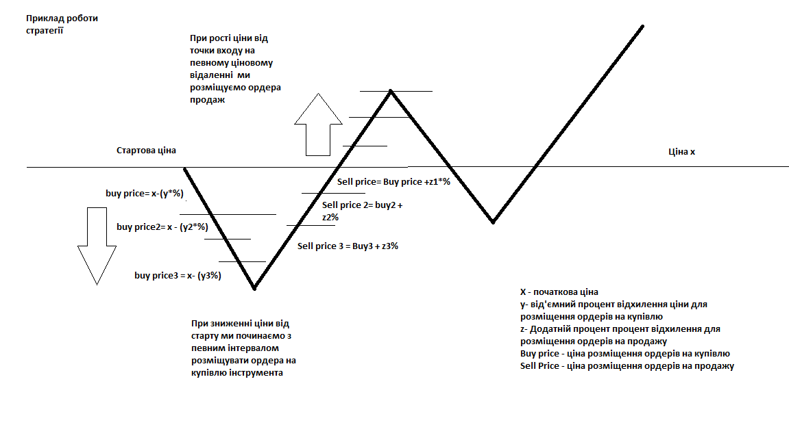

1. Завдання на математичну логіку та пошук эффективних рішень на основі історичних данних на певному протязі часу.  
Стратегія дуже проста і може підійти навіть для тих хто нічого не розуміє в трейдингу бо стратегія базується на основних принципах торгівлі, купуй коли продают, продавай коли росте.Наглядний приклад роботи на Рис 1. 

Рис 1.
Детальний опис стратегії:

Стратегія полягая в тому, що капітал ми ділимо на певну кількість рівних частин.Кожна частина цього поділеного капіталу виділяється під певний вхід- купівлю(buy price) на певній віддаленості від стартової ціни. Розташування цих ордерів відбувається сіткою на певній віддаленості один від одного, тобто ми розбиваємо наші входи на різній віддаленості від початкової ціни. Вихід –(sell price) з кожної позиції відбувається наступним шляхом, після купівлі розташовується відповідний ордер на продаж, на певній процентній віддаленості від точки входу.  

Приклад  
Приклад реалізації ми розбиваємо капітал на 15 рівних частин і розміщуємо входи  на такій віддаленості:Вхід - купівля5 входів з віддаленістю один від одного -  2%5 входів з віддаленістю один від одного – 4 %5 входів з віддаленістю один від одного – 6 %Вихід – продажвихід з кожної позиції 4%Сітка розрахована на зниження ціни на 62%  від початкової ціни, має постійний не змінний вихід в 4% який відповідає загальній тенденції ринку до зростання, 3 діапазони для врахування можливості ціни рухатися в різних цінових значеннях.Завдання. За заданим алгоритмом, обрати будь який інструмент: https://www.binance.com/uk-UA/trade/BTC_USDT?theme=dark&type=spot
Обрати довільний проміжок часу – тиждень, місяць, пів року, рік…. Розглядайте зміну ціни в обраному проміжку , як певний випадковий розподіл ціни в певному діапазоні. Запропонувати теорію ефективного проторговки данного діапазону за попередньо вказаною стратегією.1. Запропонувати певний алгоритм виставлення сітки ордерів на купівлю, який буде враховувати, такі умови, що ціна може рухатися певний час в вузькому діапазоні, падати, або зростати.2. Алгоритм виходів, це може бути не конкретний варіант з одним процентом, а під кожний окремо діапазон.Чого ми від вас очікуємо: запропонувати теорію ефективної проторговки обраного діапазону за алгоритмом.На, що ми звернемо увагу: який логічний підхід було використано для рішення цієї задачі, які розрахунки ви робили та які моделі ви побудували. Важливо і саме головне показати здатність мислити і створювати теорії.  

2. Практичне завдання з программування  
Створити імітацію роботи запропонованої Вами стратегії на історичних даних. Для перевірки правильності роботи коду можна вибрати часовий діапазон і порівняти ордери отримані за допомогою програмної та ручної імітації стратегії. 
Після завершення імітації виводити статистику стратегії: кількість та відсоток прибуткових/збиткових угод, загальний прибуток у відсотках тощо. Креатив вітається.

